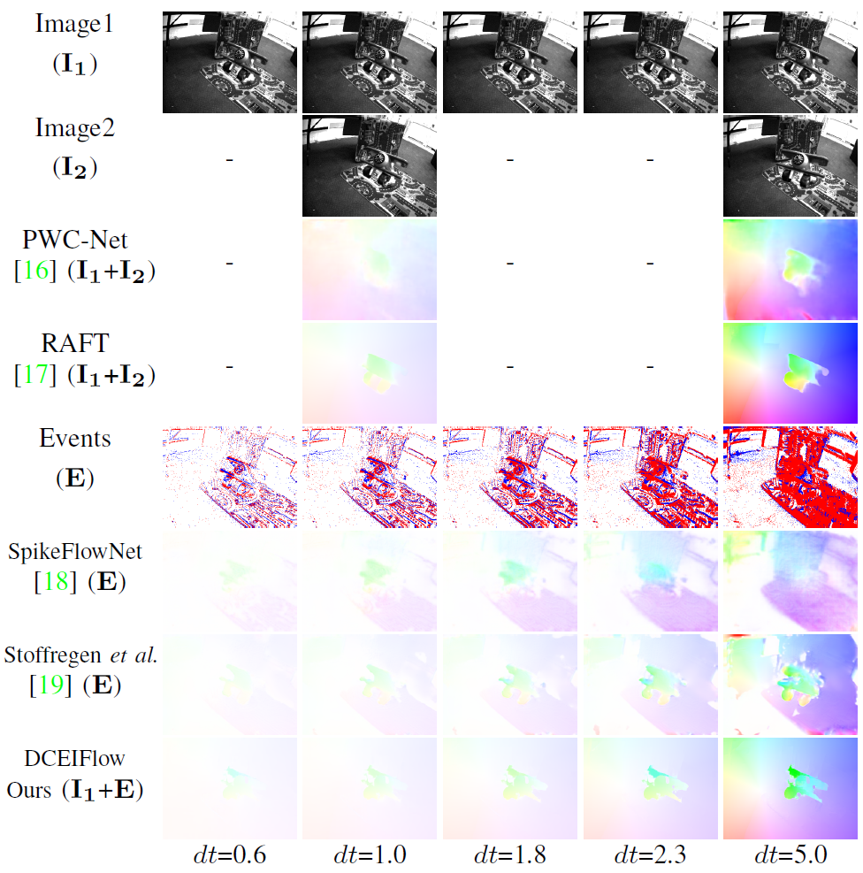

# DCEIFlow
This repository contains the source code for our paper:

Learning Dense and Continuous Optical Flow from an Event Camera 

TIP 2022

Zhexiong Wan, Yuchao Dai, Yuxin Mao

[Project Page](https://npucvr.github.io/DCEIFlow/), [Arxiv](), [IEEE]()

**Commercial use are not allowed.**




## Requirements
The code has been tested with PyTorch 1.12.1 and Cuda 11.7.

## Pretrained Weights

Pretrained weights can be downloaded from 
[Google Drive](https://drive.google.com/drive/folders/1Dh7BqXozY59SZKOgVj7_yZ5d09R8qilw?usp=share_link).

Please put them into the `checkpoint` folder.

## Evaluation

To evaluate our model, you need first download the HDF5 files version of [MVSEC](https://lmb.informatik.uni-freiburg.de/resources/datasets/FlyingChairs.en.html#flyingchairs2) datasets.

```
data/MVSEC_HDF5
├── indoor_flying
│   ├── indoor_flying1_data.hdf5
│   ├── indoor_flying1_gt.hdf5
│   ├── indoor_flying2_data.hdf5
│   ├── indoor_flying2_gt.hdf5
│   ├── indoor_flying3_data.hdf5
│   ├── indoor_flying3_gt.hdf5
├── outdoor_day
│   ├── outdoor_day1_data.hdf5
│   ├── outdoor_day1_gt.hdf5
│   ├── outdoor_day2_data.hdf5
│   ├── outdoor_day2_gt.hdf5
```

After the environment is configured and the pretrained weights is downloaded, run the following command to get the consistent results as reported in the paper.

```
python main.py --task test --stage mvsec --checkpoint ./checkpoint/DCEIFlow_paper.pth
```

The results reported in our paper are simulated with [esim_py](https://github.com/uzh-rpg/rpg_vid2e). We also provide anther pretrained model using a new simulator, [DVS-Voltmeter](https://github.com/Lynn0306/DVS-Voltmeter), thanks for this open source project. It improves the performance on Chairs and Sintel, while MVSEC is basically unchanged. **We recommend using the updated model because of better generalization performance.**

```
python main.py --task test --stage mvsec --checkpoint ./checkpoint/DCEIFlow.pth
```


## Training

To train our model, you need to download the [FlyingChairs2](https://lmb.informatik.uni-freiburg.de/resources/datasets/FlyingChairs.en.html#flyingchairs2) datasets and simulate the events corresponding to every two frames. 
```
data/FlyingChairs2
├── train
├── val
├── events_train
├── events_val
```

The simulated events are stored in HDF5 format with name ```******-event.hdf5```. Please refer to the  ``read_event_h5()`` function in ``utils/file_io.py``.

After completing the simulation, you can run the following command to start the training. 

```
python main.py --task train --stage chairs2 --isbi --model DCEIFlow --batch_size 4 --epoch 200 --lr 0.0004 --weight_decay 0.0001 --loss_gamma=0.80 --name DCEIFlow
```


### Bibtex
If our work or code helps you, please cite our paper. 

**If our code is very useful for your new research, I hope you can also open source your code including training.**

```
@article{wan2022DCEIFlow,
    author={Wan, Zhexiong and Dai, Yuchao and Mao, Yuxin},
    title={Learning Dense and Continuous Optical Flow from an Event Camera}, 
    journal={IEEE Transactions on Image Processing}, 
    DOI=10.1109/TIP.2022.3220938,
    year={2022}
}
```

### Acknowledgments

This research was sponsored by Zhejiang Lab.

Thanks the assiciate editor and the reviewers for their comments, which is very helpful to improve our paper. 

Thanks for the following helpful open source projects: 

[RAFT](https://github.com/princeton-vl/RAFT), 
[event_utils](https://github.com/TimoStoff/event_utils), 
[EV-FlowNet](https://github.com/daniilidis-group/EV-FlowNet), 
[mvsec_eval](https://github.com/TimoStoff/mvsec_eval),
[esim_py](https://github.com/uzh-rpg/rpg_vid2e),
[DVS-Voltmeter](https://github.com/Lynn0306/DVS-Voltmeter),
[Spike-FlowNet](https://github.com/chan8972/Spike-FlowNet).
